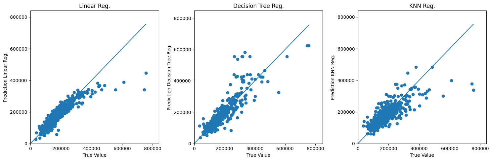
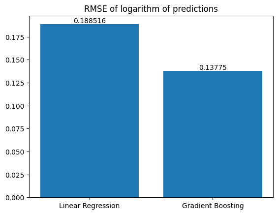
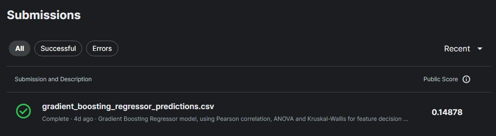
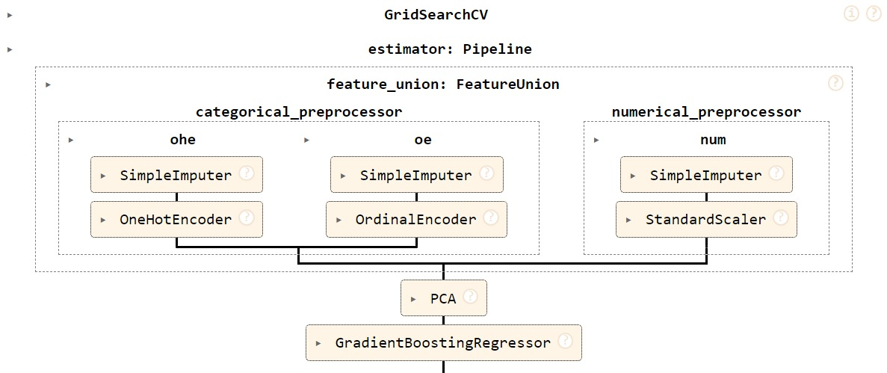
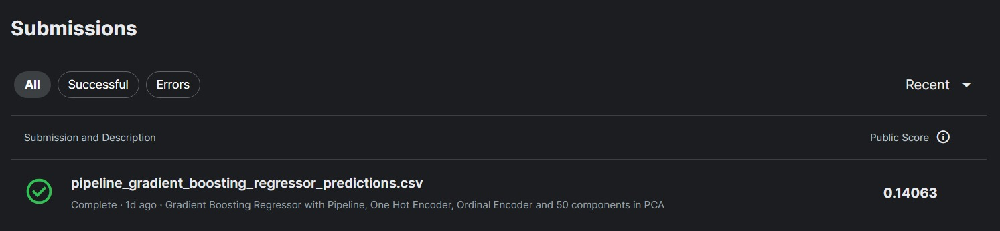

# House Prices Advanced Regression Techniques

This repository was created for a kaggle competition to predict sales price from houses. The competition dataset, data description, other competitors code and more can be seen [here](https://www.kaggle.com/competitions/house-prices-advanced-regression-techniques).

### Baseline Model
As a first step, we've made simple transformations in the dataset as indicated in the list below:

1. Removed all columns with 10% or more null values.
2. Filled all null values with the value -1.
3. Kept only numeric columns.

We've then split the data into 67% train data and 33% test data and **trained 3 regressors: Linear Regression, Decision Tree Regressor and K-Nearest Neighbors Regressor**. We've used Mean Square Error (MSE) and Mean Absolute Error (MAE) to compare those models. **No hyperparameter tuning** was made as this is just a baseline model.

We've found that the **Linear Regression achieved the smallest error** in both MSE and MAE and we've utilized this model to submit the first predictions to the Kaggle competition.

  <table border="1">
    <tr>
      <th></th>
      <th>Linear Regression</th>
      <th>Decision Tree Regressor</th>
      <th>KNN Regressor</th>
    </tr>
    <tr>
      <td>MSE</td>
      <td>1.534E9</td>
      <td>2.138E9</td>
      <td>2.734E9</td>
    </tr>
    <tr>
      <td>MAE</td>
      <td>2.376E4</td>
      <td>2.716E4</td>
      <td>3.327E4</td>
    </tr>
  </table>

Visualy, we plotted the charts below that also can be used to compare models predictions with true sales prices. The idea is that the closest the dots are to the diagonal line ($y=x$) the better the model predicts the sales price.

The python notebook for this model can be found [**here**](base_model_linear_regression.ipynb) and the submission score in the image below.

### Gradient Boosting Regressor
For this model we've selected the most relevant features using the [Pearson correlation](https://en.wikipedia.org/wiki/Pearson_correlation_coefficient) for the **numeric features** and [ANOVA](https://en.wikipedia.org/wiki/Analysis_of_variance) and [Kruskal-Wallis](https://en.wikipedia.org/wiki/Kruskal%E2%80%93Wallis_test) for the **categorical features**. More details below:

1. From the numeric features, we've selected the ones where the **pearson correlation with the target (SalePrice) was higher than 30%**.
2. From those selected features, we've found some to have **collinearity**, we **removed the highest ones** as in [here](https://colab.research.google.com/github/igornunespatricio/house-prices-advanced-regression-techniques/blob/main/gradient_boosting_regressor.ipynb#scrollTo=LznirCjU3AQa).
3. After the selection of numerical features, we've created an **algorithm to select relevant categorical features**. The algorithm goes for each categorical feature and check whether it's significant to predict the target (SalePrice) or not. It uses **ANOVA** when all the levels of the categorical feature are **normally distributed**, and uses **Kruskal-Wallis** when at least one level is **not normally distributed**. From the list of significant, we've **selected the 5 most significant ones** (based on the pvalue of the test).
4. We've then **filled the train and test dataset null values** with the median values for each numerical feature and add new label to describe absence of the value in the categorical features, for example, 'NoGarage'. Except for some features, as described in the data description, that were null but should've been 0.
5. We've then followed with the transformations by using **[one hot encoding](https://en.wikipedia.org/wiki/One-hot)** for nominal categorical features and **[ordinal encoding](https://scikit-learn.org/stable/modules/generated/sklearn.preprocessing.OrdinalEncoder.html)** for ordinal categorical features.

We've then separated the train data into 75% to train and 25% as validation data and compared two models: [Linear Regression](https://scikit-learn.org/stable/modules/generated/sklearn.linear_model.LinearRegression.html) and [Gradient Boosting](https://scikit-learn.org/stable/modules/generated/sklearn.ensemble.GradientBoostingRegressor.html). We've **selected the Gradient Boosting model since it had a better performance in the [RMSE](https://scikit-learn.org/stable/modules/model_evaluation.html#mean-squared-error)** of the logarithm of the predictions and target (we've changed the evaluation metric because the kaggle competition uses the RMSE of the logs of predictions to compute the score, the log will compress the range of the target (SalePrice) observed and predicted values, returning a metric that will be less impacted by expensive and cheap houses). The metric formula can be seen below.

$$RMSE_{\log} = \sqrt{\frac{1}{n} \sum_{i=1}^{n} (\log(\hat{y}_i) - \log(y_i))^2}$$

The following figure **compares** the RMSE of the logs in the **linear regression** and **gradient boosting regressor** (the smallest the RMSE the better).

  

After selecting the Gradient boosting model, we performed **grid search** with the following set of **hyperparameters** to find the best combination:

* Learning rate: 0.001, 0.01 and 0.1

* n_estimators: 10, 100, 1000 and 10000

* criterion: friedman_mse and squared_error

We found the **squared_error criterion, 0.001 learning rate and 10000 n_estimators to be the best hyperparameters** returning the smallest RMSE of the log. We've then **persisted the model using the joblib library** for future use. The model file is a pickle file and can be downloaded from this repository [here](gbr.pkl), although this just stores the model and don't have the data cleaning and transformation pipeline.

Finally, the submission score in the kaggle competition can be seen below.

  

### Gradient Boosting Regressor with Pipeline

In this part we **didn't remove any columns** from the database. Instead, we went through each of the features in the data description file and **separated them into categorical nominal, categorical ordinal and numerical groups**. We've then **filled null values** according to the type of the feature, used **one hot encoders**, **ordinal encoders** and **scaled the features**. With the results, we applied **PCA for dimensionality reduction** and then applied **gradient boosting regressor**. The steps can be seen in the image below.

  <a href="https://colab.research.google.com/github/igornunespatricio/house-prices-advanced-regression-techniques/blob/main/pipeline_gbr.ipynb#scrollTo=Gshv-E26Lawv&line=1&uniqifier=1"
    
  </a>

)

More details of the pipeline below:

1. The **SimpleImputer box** above the OneHotEncoder and the Ordinal Encoder **fill the null values with the value "No Feature"** (this was done because most categorical features that have with null values means no feature at all as per the data description).
2. The SimpleImputer box above the SandardScaler is for the numerical features  and it **fills null values with the median**.
3. We performed **one hot encoder** for each **nominal feature** setting an infrequent class and sending the possible unknown values for that class.
4. We performed **ordinal encoder** for each **ordinal feature** setting unknown values to -1. (Differently from the one hot encoder, the **ordinal encoder maps the ordinal values to integers**, for example, 0 for "No Feature", 1 for "Poor Quality", 2 for "Average Quality", etc)
5. We performed **StandardScaler** in the numerical features. The StandardScaler is necessary because **models might underperform with unscaled features**.
6. We've then used **PCA for dimensionality** reduction since after the preprocessing we ended up with 100+ features. The PCA helps getting the **combination of features that better explains the variance of the data**.
7. With the results from PCA we run gradient boosting regressor.

We've used **grid search** in this pipeline to get the best hyperparameters of the gradient boosting regressor and the PCA. We've performed grid search with **5 folds** (this parameter essentially separates the data into 5 sets of data where 4 of them will be used for training and 1 for testing), used the **RMSE of the logs** as the scoring metric as per the competition and tested many combination of hyperparameters. The **best hyperparameters** were **50 components in PCA** (essentially this is the new feature space after applying PCA), **maximum depth of 5** for each tree in the gradient boosting regressor and **300 tree estimators**. The python notebook for this model is here ([pipeline_gbr.ipynb](https://colab.research.google.com/github/igornunespatricio/house-prices-advanced-regression-techniques/blob/main/pipeline_gbr.ipynb)) In the end, we submitted the model to the kaggle competition and got **better results** as can be seen in the image below.

  

### Gradient Boosting Regressor with Pipeline 2.0

Again using **Gradient Boosting Regressor**, but now a **different pipeline**. Main differences from the last one was that I applied **one hot encoders for all categorical features**, but continued with PCA for dimensionality reduction (**even more important now after this preprocessing let me with 300+ columns**) and gradient boosting regressor again. 
I also **log scaled the feature target** (SalePrice) since it had outliers. The scikit learn pipeline can be seen below.

  

At this point, I used grid search with the following hyperparameters:

- PCA n_components. I tried 100, 200 and 300. 
- gradient boosting regressor hyperparameters:
- learning rate 0.001, 0.01 and 0.1
- n_estimators: 10, 50, 100 and 200
- max_depth: 1, 3, 5 and 10

In the end, after some **hours of training**, the **best combinations** of hyperparameters were **200 components for PCA**, and for the gradient boosting regressor were **0.1 learning rate**, **max_depth of 3** and **200 estimators**. 

**Submitting to kaggle**, I improved **the RMSE of the log to 0.13887** as per image below. You can see this model file [here](notebooks/pipeline_gbr_all_ohe.ipynb).

  

Obs: I also left some **other model files** with tests that I've done along the way that **didn't improve the model**. For example, in the files [pipeline_indicator_column.ipynb](notebooks\pipeline_indicator_column.ipynb) and [pipeline_with_feature_target_transform.ipynb](notebooks\pipeline_with_feature_target_transform.ipynb), I **created two column transformers**: one to indicate **presence or absence of the feature** for each categorical column, and another to **selected best numeric features according to pearson correlation** between features and the target and features with themselves. All selections based on thresholds. I left both transformers in [this python file](notebooks\custom_transformers.py). Sadly they took some hours to train and no improvement was observed, but I saved them in case I want to revisit this project.